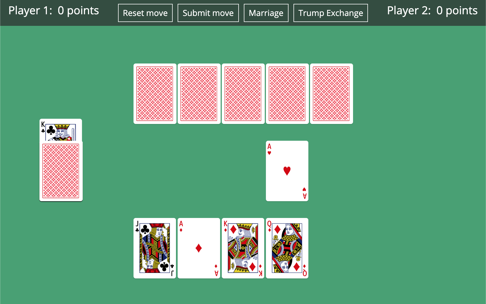

AI Schnapsen
========================

## Schnapsen

To get to know the concept of the game, please visit
[this web page](https://www.pagat.com/marriage/schnaps.html).

## Visual interface

We provide a visual interface which you can use to familiarize yourself with the game, and to play against your own bots later on.

<div align="center">
    
</div>

\
The following example starts a local server and sets *rdeep*, an already implemented bot, as the opponent.

```bash
python visual/server.py --opponent rdeep
```

The "--opponent" flag is followed by the name of the bot you want to play against.

To see a full list of parameters and their usage, run:

```bash
python visual/server.py --help
```

Once your server is up and running, you can fire up your favorite (modern) web browser and visit
[http://127.0.0.1:5000/](http://127.0.0.1:5000/), the local address where your server is listening.

The controls are fairly straightforward; click on the card that you want to play to place it on
the table. You can decide to play this move by clicking the "Submit move" button on the top bar, or you can
change your mind with "Reset move". Whenever you have a complex move available, such as a marriage or
a trump jack exchange, the corresponding buttons on the top bar will become available. Finally, you can
use SHIFT + R to start a new game at any time.

## API

### Get the size of the stock
Let 'state' be the state you're given and let's say you want the size of the stock. Then the following a should do the trick:
```python
size_of_stock = state.get_stock_size()
```

### Find out if I'm player 1 or 2

```python
me = state.whose_turn()
```

### Print the (abbreviated) cards in your hand

```python
cards_hand = state.hand()

for i, card in enumerate(cards_hand):

	rank, suit = util.get_card_name(card)

	print('Card {} in the hand is {} of {}'.format(i, rank,suit))
```

The deck of cards is represented through a list. Each index corresponds to a different card, as per the table below.

|          | Aces | 10s | Kings | Queens | Jacks |
|:--------:|:----:|:---:|:-----:|:------:|:-----:|
| **Clubs**|   0  |  1  |   2   |    3   |   4   |
|**Diamonds**|   5|  6  |   7   |    8   |   9   |
|**Hearts**|  10  |  11 |   12  |   13   |   14  |
|**Spades**|  15  |  16 |   17  |   18   |   19  |

### Generate a random state
```python
state = State.generate()

# To deterministically generate the same state each time, the generate method can also take a seed, like so:

state = State.generate(25)
# This will always generate the same starting state, to make testing/debugging your bots easier.
# Note that any two states generated with the same seed will be identical, and 25 is only used here as an example.
```

### Check if two states are identical

```python
state = State.generate(1)

# same_state is not the same object as state,
# but all attributes are identical.
same_state = State.generate(1)

diff_state = State.generate(2)

# The equality and inequality operators are overridden for State
# objects, so you can check if all parameters of two states match.

state == same_state # Evaluates to True
state == diff_state # Evaluates to False
```

### Print a representation of the generated state
```python
>>> print(state)

The game is in phase: 1
Player 1's points: 0, pending: 0
Player 2's points: 0, pending: 0
The trump suit is: C
Player 1's hand: QC JD 10H JH 10S
Player 2's hand: 10C AD 10D KH JS
There are 10 cards in the stock
```
### Get own/opponent's points

```python
me = state.whose_turn()
opponent = util.other(me)

own_points = state.get_points(me)
opponents_points = state.get_points(opponent)
```

### Get familiar with the `State` API

Every state-related function you will use when building your bot can be found, fully documented, in the State class, located in api/_state.py. We *highly recommend* that you read through this class to understand the available capabilities.

Note that you only have access to public functions. Private functions, i.e. functions whose name starts with two underscores "__" are used for the internal implementation of the game and are abstracted away from the player.

## Contributions

Vectorized Playing Card Graphics 2.0 - http://sourceforge.net/projects/vector-cards/  
Copyright 2015 - Chris Aguilar - conjurenation@gmail.com  
Licensed under LGPL 3 - www.gnu.org/copyleft/lesser.html
